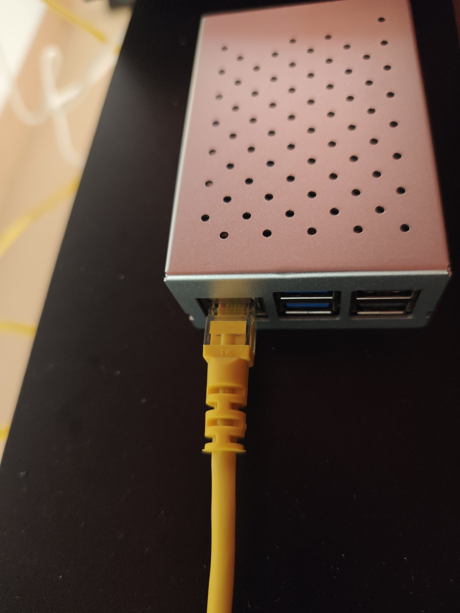
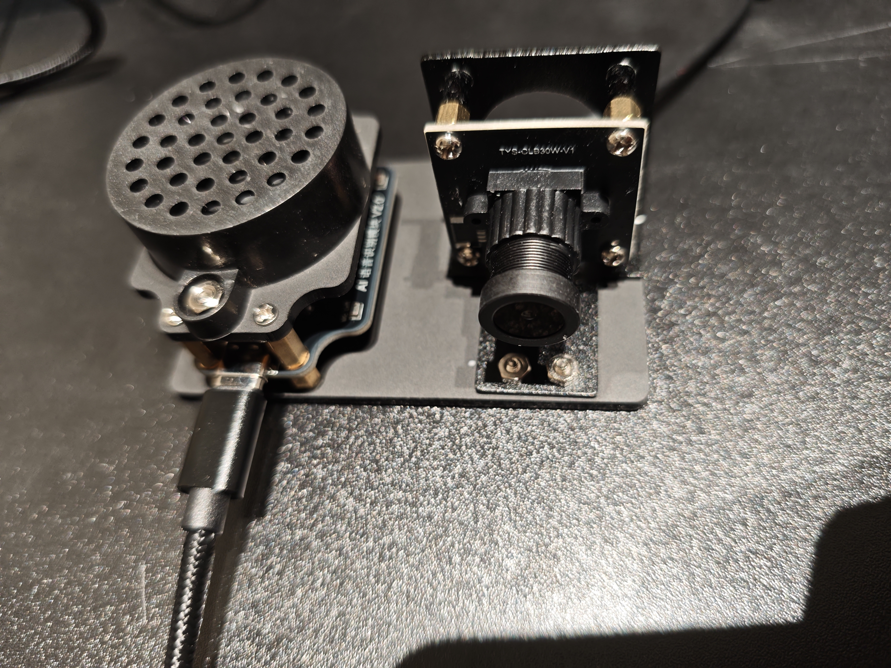
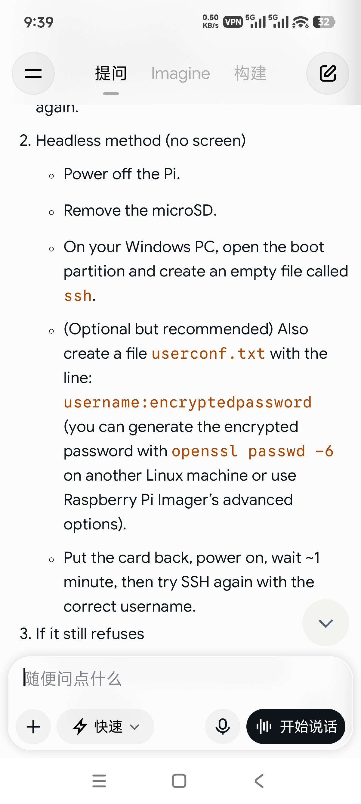

# 树莓派 5 部署大模型：基础环境搭建指南

> **本文不是流水账日志，而是一份可复现的实操教程。**
> 目标读者：手上拿到树莓派 5、准备部署视觉 / 语音大模型应用，但还没把底层环境跑通的人。
> 本文的目标：让你**避开我们踩过的坑**，按顺序、可验证地把「系统 → 摄像头 → 麦克风 / 扬声器」整条基础链路打通。
>
> 适用范围：Raspberry Pi 5 + Raspberry Pi OS 64-bit（Debian 12/13 系列）。
> 树莓派 4 及更早机型可参考，但**第四章的坑 1、坑 2 是树莓派 5 特有的，务必单独看**。

---

## 阅读指引

| 你的情况 | 建议阅读顺序 |
| :--- | :--- |
| 刚拿到板子，还没开机 | 全部按顺序读，重点 **第二章 → 第三章** |
| 板子通电但进不去系统 | 直接跳到 **第二章** 与 **4.1 / 4.2** |
| 系统能进，但 SSH 连不上 | **3.3** 与 **4.3** |
| `pip install` 报错 | **4.4** 与 **第八章附录 B** |
| 只想抄命令 | **第七章 命令速查** |
| 基础环境已好，要跑本地大模型 | 转去看 **[ollama-deepseek-local.md](ollama-deepseek-local.md)** |
| 想直接做出能用的助手应用 | 转去看 **[multimodal-assistant.md](multimodal-assistant.md)** |
| 想做温湿度看板 / 语音控制设备 | 转去看 **[iot-dashboard.md](iot-dashboard.md)** |

### 本仓库的文档分工

| 文档 | 内容 | 适用阶段 |
| :--- | :--- | :--- |
| **README.md**（本文） | 系统刷写、Headless SSH、换源、摄像头、声卡、故障排查 | 第一步：把硬件和系统跑通 |
| **[ollama-deepseek-local.md](ollama-deepseek-local.md)** | Ollama 手动安装、编译 `llama-server`、DeepSeek-R1 模型与 API 调用 | 第二步：验证本地推理能力 |
| **[multimodal-assistant.md](multimodal-assistant.md)** | 多模态桌面助手：架构设计、两个脚本解析、踩坑复盘、面向 AI 辅助工业控制的演进路线 | 第三步：做出可用的应用 |

> 🎯 **推荐路径**：先把硬件和系统跑通（本文）→ 理解本地推理的边界（ollama 篇）
> → 做出真正能用的多模态助手（**multimodal-assistant 篇**，含完整代码与避坑指南）。

**核心结论先给**：树莓派 5 部署大模型的失败，**十次里有八次不是软件问题，而是供电和散热问题**。请把这句话记在心里，它会在下文的每个环节救你一次。

---

## 一、成果与最终形态

环境搭好后，你应该能得到下面这套状态——这也是本文的验收标准：

| 状态 | 能力 | 如何验证 |
| :---: | :--- | :--- |
| ☑ | 树莓派 5 稳定启动，无欠压降频 | `vcgencmd get_throttled` 返回 `0x0` |
| ☑ | 无显示器（Headless）下可 SSH 登录 | Windows 终端能 `ssh pi@<IP>` 登录成功 |
| ☑ | 系统源已换成国内镜像 | `apt update` 速度达到 MB/s 级 |
| ☑ | USB 摄像头可抓拍 | `fswebcam` 生成 `.jpg` 且能打开 |
| ☑ | USB 声卡录音、放音正常 | `arecord` 录到 `.wav`，`aplay` 能听见自己的声音 |

### 硬件实拍



上图是本指南对应的实物形态，有两个细节值得学习者注意：

- **铝合金外壳顶部的开孔**是散热风道的进 / 出风口。树莓派 5 的 SoC 满载发热远大于树莓派 4，铝合金外壳本身是**被动散热体**，配合内部风扇才构成有效散热。买壳时务必确认是「铝合金 + 风扇」而不是纯塑料壳。
- **黄色的以太网线**是刻意选择的：有线连接比 Wi-Fi 更稳定，而且**直接绕开了 `raspberrypi.local` 域名解析失败**这个高频问题（详见 4.3）。做视频流、大模型推理这类长时间占带宽的任务时，请优先用网线。

### 视觉与语音模块实拍（USB 接入的两个外设）



上图中左侧是**语音模块**，右侧是**摄像头模块**，两者都是 **USB 接口**设备，直接插到树莓派的 USB 口即可被系统识别。对照实物认识它们，能帮你在后续章节快速对应：

| 位置 | 部件 | 对应章节 | 系统里的样子 |
| :--- | :--- | :--- | :--- |
| 左 | 圆形带孔的是**麦克风阵列 / 扬声器单元**（下方 USB-C 线缆） | 3.6 声卡验证 | `arecord -l` 里显示为 **card 2**（USB PnP Audio Device） |
| 右 | 带镜头的是**摄像头模组**（`TV5-0LB30W-V1` 板，含可调焦镜头） | 3.5 摄像头验证 | `ls /dev/video*` 里显示为 **/dev/video0** |

几个对调试有帮助的观察：

- **右侧摄像头是可调焦镜头**（镜头座有螺纹、周围是散热齿）。如果 `fswebcam` 抓出的图「清晰但虚」，先别怀疑驱动——**手动旋转镜头对焦**往往就能解决。
- **两个模块都装在亚克力底板上**，用铜柱加高。如果图像 / 音频出现「有时正常有时异常」，请先确认**铜柱螺丝没有与电路板上的元件短路**，并且**线缆插到底**（接触不良也会伪装成驱动问题）。
- **它们都是 USB 设备，共享同一个 USB 供电预算**。这正是 2.1 强调必须用 **5V 5A PD 电源**的直接原因：一旦供电不足，两个外设会同时出现「偶发故障」，让人误以为是两个独立的软件 bug。

---

## 二、上电前必须先确认的两件事（新手最容易跳过）

这一步看起来「太基础」，但**我们当天浪费最多时间的就是它**。请在上电前逐项确认：

### 2.1 电源：必须是 PD 协议、5V 5A（至少 5V 3A）

| 电源规格 | 结果 | 说明 |
| :--- | :--- | :--- |
| 5V 1A / 2A 手机充电头 | ❌ 无法启动 | 绿灯常亮，系统直接卡死 |
| 5V 3A PD 电源 | ⚠️ 可用 | 轻负载可用，高负载（AI 推理）可能欠压 |
| **5V 5A PD 电源（官方推荐）** | ✅ 推荐 | 能给 USB 外设（摄像头 / 声卡）稳定供电 |

**为什么树莓派 5 这么挑电源？**
树莓派 5 新增了 **USB 口供电能力**（可为外设提供更大电流）和更高的峰值功耗，并且**如果电源协商不到 PD 协议，系统会主动把 USB 电流限制到 600mA**。你的 USB 摄像头 + USB 声卡可能就卡在这条线上——表现出来的却是「摄像头时好时坏」「录音爆音」，让人误以为是驱动问题。

> 📌 **关键心法**：遇到任何「莫名其妙、时好时坏」的硬件故障，**先量供电**，再查软件。

### 2.2 散热：铝合金外壳 + 风扇是必选项，不是可选项

```bash
vcgencmd measure_temp      # 查看 SoC 温度（℃）
vcgencmd get_throttled     # 查看是否发生欠压 / 过热降频
```

- `measure_temp` 空闲应在 40–55 ℃，满载不建议超过 80 ℃；
- `get_throttled` 返回 `0x0` 表示正常。**只要不是 `0x0`，就说明你的电源或散热不合格**，应先解决硬件，再继续后面的软件步骤。

> 建议：把这两条命令写进一个 `check.sh`，每次开机先跑一遍，形成习惯。

---

## 三、标准搭建流程（按顺序执行）

以下每一步都给出**验证方法**。上一步没验证通过，不要进入下一步——这是排查问题最省时间的方式。

### 3.1 第一步：把系统正确写入 MicroSD 卡

**操作**：

1. 用 [Raspberry Pi Imager](https://www.raspberrypi.com/software/) 选择 **Raspberry Pi OS (64-bit)**；
2. 点击齿轮图标打开「高级选项」，**预先配置**：主机名、用户名与密码、Wi-Fi（若不用网线）、时区、开启 SSH；
3. 写入 **MicroSD 卡**；
4. 将 MicroSD 卡插入**主板底部的专用卡槽**（不是 USB 读卡器）。

**验证**：插入网线、接好电源，观察机身上的 **绿色 LED**。

| 绿灯状态 | 含义 |
| :--- | :--- |
| **常亮不闪** | ❌ 系统**没有真正启动**（电源不足 / 卡槽不对 / 卡里没有引导程序） |
| 规律闪烁（如持续读卡闪烁） | ✅ 正在启动 / 已启动 |

> 记住这张表，它是你排查一切启动问题的**第一个判断依据**，比看任何日志都快。

**常见误区**：把系统刷进 USB 读卡器后直接插到 USB 口，期待从 USB 启动。

> 树莓派 5 **默认从 MicroSD 卡启动**。USB 设备（U 盘 / SSD / NVMe）确实可以作为系统盘，但必须**先写入 / 更新 bootloader 引导程序并配置启动顺序**，不能插上就用。新手期请老老实实用 MicroSD 卡，把 USB 启动留到熟练之后。

### 3.2 第二步：无头模式（Headless）首次连接

如果 Imager 的「高级选项」已经配好了 SSH 和用户，这一步通常可以直接连上。若你用的是裸镜像、没配过，需要手动补两个文件（把卡插回电脑，访问 boot 分区）：



上图是当时排查 SSH 问题时参考的标准做法，两个要点：

1. **创建名为 `ssh` 的空文件**（注意：无扩展名，不是 `ssh.txt`）——只有存在这个文件，系统首次启动才会开启 SSH 服务；
2. 可选但推荐：**创建 `userconf.txt`**，内容一行 `username:encryptedpassword`。密码不能明文，需要用 `openssl passwd -6` 生成哈希，或直接用 Imager 的「高级选项」代劳。

- `ssh` 文件的作用：**开启 SSH 服务**；
- `userconf.txt` 的作用：**创建用户并设密码**（树莓派默认**没有 root 用户**，这一点直接影响 SSH 报错的理解，见 4.3）。

**验证**：把卡插回树莓派，上电，等约 1 分钟，然后尝试登录：

```powershell
ssh pi@<树莓派IP>
```

### 3.3 第三步：如何可靠地拿到树莓派 IP（不要依赖主机名）

```powershell
ping raspberrypi.local          # 尝试 mDNS 解析
arp -a                          # 查看局域网内已知设备
```

**这两种方法都不可靠，原因如下**：

- `raspberrypi.local` 依赖 **mDNS（Bonjour / Avahi）**。Windows 默认没有完整 mDNS 支持，解析失败是常态，**不是树莓派的问题**；
- `arp -a` 会列出路由器下**所有**设备（手机、电脑、电视盒子……），你无法判断哪个是树莓派。

✅ **推荐做法：登录路由器管理后台，查看 DHCP 客户端列表**，找到主机名（你在 3.1 里设置的）对应的 IP。这是唯一确定性最高的方式。

> **进阶技巧（强烈建议学会）**：在路由器后台给树莓派绑定**静态 IP / DHCP 保留地址**。这样 IP 永不变，之后所有脚本、`scp`、SSH 配置都不用再改。

### 3.4 第四步：系统换源（加速后续所有安装）

⚠️ **这一步和网上大多数教程不一样，请注意新版系统的文件变化**：

| 系统版本 | 配置文件 | 格式 |
| :--- | :--- | :--- |
| 旧版 | `/etc/apt/sources.list`、`/etc/apt/sources.list.d/raspi.list` | 传统单行格式 |
| **新版（Debian 12/13）** | `/etc/apt/sources.list.d/debian.sources`、**`raspi.sources`** | **`.sources` 结构化格式（deb822）** |

**关键变化**：旧教程里改的 **`raspi.list` 已经不存在了**，被 **`raspi.sources`** 取代。照着旧教程 `nano /etc/apt/sources.list.d/raspi.list` 会打开一个空文件，然后你会以为自己改成功了——实际上并没有生效。

**操作**：

1. 备份原文件：

   ```bash
   sudo cp /etc/apt/sources.list.d/debian.sources /etc/apt/sources.list.d/debian.sources.bak
   sudo cp /etc/apt/sources.list.d/raspi.sources   /etc/apt/sources.list.d/raspi.sources.bak
   ```

2. 用清华 TUNA 镜像源替换其中的 `URIs` 字段（**只改 `URIs`，`Suites` / `Components` 不要动**），然后把 `raspi.sources` 里的地址换成清华的树莓派仓库；
3. 更新并**验证速度**：

   ```bash
   sudo apt update
   ```

**验证**：`apt update` 的输出速度应为 MB/s 级别。如果仍然只有几十 KB/s，说明源没生效，回到第 1 步检查文件名与拼写。

### 3.5 第五步：验证 USB 摄像头

> 对应实物：第一章「视觉与语音模块实拍」中**右侧的摄像头模组**。

```bash
ls /dev/video*                                        # 确认设备号，通常为 /dev/video0
fswebcam -d /dev/video0 --skip 20 -r 1280x720 --no-banner test2.jpg
```

**参数为什么这么写（理解了才不用背）**：

| 参数 | 作用 | 不加会怎样 |
| :--- | :--- | :--- |
| `-d /dev/video0` | 指定设备 | 多摄像头时可能选错 |
| `--skip 20` | 丢弃前 20 帧 | 首帧往往是自动曝光未收敛的**全黑 / 过曝**图 |
| `-r 1280x720` | 分辨率 | 默认分辨率较低 |
| `--no-banner` | 不叠加时间戳横幅 | 图像上会有文字，干扰后续视觉模型识别 |

**验证**：把图片拉回 Windows 查看（在 **Windows PowerShell** 中执行）：

```powershell
scp pi@<树莓派IP>:~/test2.jpg .
```

能看清明亮的画面 = 摄像头链路打通。若是全黑，先加大 `--skip`，再检查供电（回到 2.1）。

### 3.6 第六步：验证 USB 声卡（录音 + 放音）

> 对应实物：第一章「视觉与语音模块实拍」中**左侧的麦克风阵列 / 扬声器模块**。

```bash
arecord -l        # 列出录音设备，记下 card 号（本机为 card 2）
aplay -l          # 列出播放设备
```

USB 音频设备的 card 号**不是固定为 0**——本机因为主板自带音频占用，USB 声卡是 **card 2**。请在后续所有命令里**明确指定 card 号**，不要依赖默认设备。

```bash
alsamixer                                      # 按 F6 选择 "USB PnP Audio Device"
# 在 alsamixer 中：按 M 解除静音（显示 "MM" 即为静音），方向键调音量
arecord -D plughw:2,0 -d 5 -f cd test_voice.wav   # 录 5 秒
aplay   -D plughw:2,0 test_voice.wav              # 回放
```

**验证**：`aplay` 能听到清晰的录音 = 语音输入输出链路打通。
若录出来是静音，**90% 是 `alsamixer` 里的静音没解除**，而不是驱动问题。

---

## 四、故障排查手册（按现象查）

> 这一章是全文**最有价值的部分**。请按「现象」定位，而不是按「原因」猜。

### 4.1 现象：绿灯常亮，系统无任何反应

| 排查顺序 | 检查项 | 处理 |
| :---: | :--- | :--- |
| 1 | 电源是否为 5V 5A PD？ | 换用官方电源或合格的 PD 电源 |
| 2 | 是否接了风扇 / 散热是否到位？ | 补上主动散热 |
| 3 | MicroSD 卡是否插在**主板底部专用卡槽**？ | 换到正确卡槽 |
| 4 | 是不是把系统刷进了 USB 读卡器想从 USB 启动？ | 回到 MicroSD 卡启动 |
| 5 | 卡内是否真的写入成功、有无 `bootfs` 分区？ | 重新刷写并校验 |

**核心判断依据**：**绿灯常亮 ≈ 系统没有真正启动**。这时去查系统日志、改配置、重装软件**全是无效功**——请把时间花在电源、卡槽、镜像这三件事上。

### 4.2 现象：能启动但频繁卡死 / 重启 / 外设时好时坏

**这是典型的欠压（under-voltage）症状，不是软件 bug。**

```bash
vcgencmd get_throttled
```

- 返回 `0x0`：正常；
- 返回非 `0x0`（如 `0x50000`）：说明**曾经发生过**欠压 / 降频。请立刻换电源。

**为什么容易被误判**：摄像头偶发花屏、录音有爆音、SSH 突然掉线，看起来像是三个不同的驱动问题，**实际上是一个电源问题**。先解决供电，往往会同时消失。

### 4.3 现象：SSH 显示 `Connection refused`

**注意区分两类错误**——它们的原因完全不同：

| 错误信息 | 含义 | 排查方向 |
| :--- | :--- | :--- |
| `Connection refused` | **能连到主机，但 22 端口没有服务在监听** | 系统没启动（回 4.1）或 SSH 服务未开启 |
| `Connection timed out` | **根本连不到主机** | IP 错了、不在同一网段、防火墙 |

`Connection refused` 的两个典型原因：

1. **系统未真正启动**——对应 4.1 的绿灯常亮；
2. **用户名错误**——树莓派**默认没有 root 用户**，不能用 `ssh root@...`；必须用 `pi` 或你在 Imager / `userconf.txt` 里**自定义的用户名**。

> 另外，若 boot 分区里**没有 `ssh` 空文件**，新版系统默认**不开启 SSH**，也会导致连接被拒（回 3.2）。

### 4.4 现象：`pip3 install` 报 `externally-managed-environment`

**这是 Python 3.11+ 的 PEP 668 保护机制，不是你的环境坏了。**

系统 Python 由 `apt` 管理，PEP 668 禁止 `pip` 擅自往系统环境里装包，以免破坏发行版依赖。

**三种解决方式，按推荐顺序**：

| 方案 | 命令 | 适用场景 |
| :--- | :--- | :--- |
| ✅ **首选：用 apt 装系统包** | `sudo apt install python3-xxx` | 有官方打包的库（如 `python3-pyaudio`） |
| ✅ **推荐：用虚拟环境** | `python3 -m venv .venv && source .venv/bin/activate` | 需要特定版本 / 第三方库 |
| ⚠️ 最后手段：强制安装 | `pip3 install --break-system-packages xxx` | 万不得已，可能污染系统 Python |

**本项目的实践**：语音识别依赖用 apt 直接装，一次性绕开保护：

```bash
sudo apt install python3-speechrecognition python3-pyaudio flac -y
```

> 注意 `flac` 也要装：`speech_recognition` 在转换音频格式时会调用 `flac` 命令行工具，**少了它会在运行时（而不是安装时）才报错**，非常容易漏。

---

## 五、下一步：打通视觉与语音链路

底层验证完毕后，才是真正「部署大模型」的部分。以下是推荐路线与**选择理由**。

### 5.1 📷 视觉：从视频流到多模态识别

**阶段 1｜实时视频流**
用 `mjpg-streamer` 或 `motion` 把摄像头变成 HTTP 视频流，在 Windows 浏览器里实时预览。

> **为什么先做这一步**：先让画面「可见」，后续调模型时你能立刻分辨「是摄像头问题还是模型问题」。这是最省时间的调试前提。

**阶段 2｜对接多模态大模型**
按硬件商家提供的 **LLaVA** 教程配置 Python 脚本，把抓拍图像送入模型识别。

> **学习建议**：先用**单张静态图**跑通「图像 → 文字描述」，确认模型可用后，再改成从视频流抽帧。不要一上来就做实时视频推理，树莓派 5 的算力需要你先摸清延迟边界。

### 5.2 🎤 语音：ASR 引擎怎么选

| 方案 | 联网 | 成本 | 适用性 |
| :--- | :---: | :--- | :--- |
| `recognize_google`（多数教程默认） | 必须 | 免费 | ❌ **国内大概率超时**，仅适合快速冒烟测试 |
| **Vosk 离线引擎** | ❌ 不需要 | 免费 | ✅ **推荐**，中文轻量模型约 40–50MB，本地实时 ASR |
| 百度智能云 / 讯飞开放平台 API | 必须 | 有免费额度 | ✅ 识别准确率高，适合作为 Vosk 的备选或补充 |

> ⚠️ **重要认知**：网上大量树莓派语音教程直接调用 `recognize_google`，**在国内网络环境下会长时间卡住直至超时**。请**一开始就规划离线方案（Vosk）**，不要等踩坑之后再改架构。

> ✅ **本仓库已给出实际落地方案**：在真正做多模态助手时，我们最终选了
> **阿里云百炼 `qwen3-asr-flash`** 做语音识别（支持本地文件直传），
> **`sherpa-onnx` 做本地离线 TTS**。完整选型理由与踩坑记录见
> **[multimodal-assistant.md](multimodal-assistant.md)**。

### 5.3 完整链路：语音 → 大模型 → 语音

```text
麦克风 (card 2)
      │  arecord
      ▼
   ASR（Vosk 离线 / 百度 / 讯飞）
      │  识别出文字
      ▼
   Prompt  ──►  大模型（本地 Ollama 或联网 API）
                        │  生成回答
                        ▼
   扬声器 (card 2)  ◄──  TTS（文本转语音）
```

**各环节要点**：

- **ASR**：录音用 `arecord -D plughw:2,0`，务必显式指定 card 号（见 3.6）；
- **大模型**：本地用 **Ollama**（推荐 `deepseek-r1:1.5b`，树莓派 5 上 4GB 内存即可运行），或调用联网 API —— 完整安装步骤与 10 个坑见 **[ollama-deepseek-local.md](ollama-deepseek-local.md)**；
- **TTS**：输出到 `card 2` 扬声器；注意做好「录音」与「放音」的互斥，否则会自激啸叫。

---

## 六、给学习者的经验总结

如果只记三句话：

1. **绿灯常亮，就查供电和卡槽** —— 不要浪费时间去改系统和配置；
2. **`get_throttled` 不为 `0x0`，就先换电源** —— 大量「多个不同外设同时出问题」其实是同一个供电问题；
3. **新版 Debian 的配置文件名和 Python 环境规则都变了** —— 照抄旧教程前，先确认文件是否还存在（如 `raspi.list` → `raspi.sources`）。

**养成三个习惯**：

- 每步都用**明确的验证命令**确认，再往下走；
- 换源 / 改配置前**先备份**（`cp xxx xxx.bak`）；
- 遇到问题先**区分现象**（`Connection refused` vs `timed out`、绿灯常亮 vs 闪烁），现象不同，根因完全不同。

---

## 七、命令速查（Copy-Paste）

### 系统健康自检

```bash
vcgencmd measure_temp      # SoC 温度
vcgencmd get_throttled     # 欠压 / 降频状态（0x0 为正常）
free -h                    # 内存
df -h                      # 磁盘
```

### 音频

```bash
arecord -l                 # 查看录音设备（确认 card 号）
aplay -l                   # 查看播放设备
alsamixer                  # F6 选声卡，M 键解除静音
arecord -D plughw:2,0 -d 5 -f cd test_voice.wav   # 录 5 秒
aplay   -D plughw:2,0 test_voice.wav              # 回放
```

### 摄像头

```bash
ls /dev/video*
fswebcam -d /dev/video0 --skip 20 -r 1280x720 --no-banner test2.jpg
```

### 语音依赖安装（绕开 PEP 668）

```bash
sudo apt install python3-speechrecognition python3-pyaudio flac -y
```

### 文件传回 Windows（在 Windows PowerShell 中执行）

```powershell
scp pi@<树莓派IP>:~/test2.jpg .
```

---

## 八、附录

### 附录 A：术语表

| 术语 | 含义 |
| :--- | :--- |
| **Headless** | 无显示器 / 无键盘鼠标的运行模式，全程通过 SSH 操作 |
| **PD 协议** | USB Power Delivery，电源与设备协商功率的协议；树莓派 5 靠它获得 5A 供电 |
| **欠压（Under-voltage）** | 供电电压低于要求，导致 CPU 降频、外设异常 |
| **PEP 668** | Python 的「外部管理环境」规范，禁止 pip 随意改动系统 Python 环境 |
| **ASR** | Automatic Speech Recognition，语音转文字 |
| **TTS** | Text To Speech，文字转语音 |
| **LLaVA** | 开源多模态大模型，可输入图像进行问答 / 描述 |
| **mDNS** | 局域网主机名解析协议，`raspberrypi.local` 依赖它；Windows 支持不完整 |

### 附录 B：新旧系统差异速查（最容易照抄旧教程出错的地方）

| 项目 | 旧版 | **新版（Debian 12/13）** |
| :--- | :--- | :--- |
| APT 源文件 | `sources.list` / `raspi.list` | `debian.sources` / **`raspi.sources`**（deb822 格式） |
| 换源方式 | 直接改 URL 行 | 改 `URIs` 字段，**保留 `Suites` / `Components`** |
| Python 装包 | 直接 `pip3 install` | **受 PEP 668 保护**，需用 apt / venv / `--break-system-packages` |
| SSH 开启 | 部分镜像默认开启 | 需 boot 分区存在 **`ssh` 空文件**（无扩展名） |

### 附录 C：参考资源

- [Raspberry Pi 官方文档](https://www.raspberrypi.com/documentation/)
- [Raspberry Pi Imager 下载](https://www.raspberrypi.com/software/)
- [清华大学 TUNA 镜像源使用帮助](https://mirrors.tuna.tsinghua.edu.cn/help/raspbian/)
- [Vosk 离线语音识别](https://alphacephei.com/vosk/)（含中文轻量模型）
- [Ollama 本地大模型](https://ollama.com/)

---

## 九、复现清单（Checklist）

按顺序勾选，全部打勾即代表基础环境搭建完成：

- [ ] 使用 **5V 5A PD 电源** + 铝合金外壳 + 风扇
- [ ] `vcgencmd get_throttled` 返回 **`0x0`**
- [ ] 系统写入 **MicroSD 卡**，插在**主板底部卡槽**，绿灯正常闪烁
- [ ] 已配置 **SSH**（Imager 高级选项或 boot 分区的 `ssh` + `userconf.txt`）
- [ ] 通过**路由器后台**获取到树莓派 IP，并绑定**静态 IP**
- [ ] 已换源（注意是 **`raspi.sources`**），`apt update` 达到 MB/s
- [ ] `fswebcam` 抓拍成功，图片清晰可辨
- [ ] `arecord -l` 确认真实 card 号（本机为 **card 2**）
- [ ] 录音 + 回放正常（`alsamixer` 已解除静音）
- [ ] `sudo apt install python3-speechrecognition python3-pyaudio flac -y` 执行成功
- [ ] 已选定 ASR 方案（推荐 **Vosk 离线**）并下载中文模型
- [ ] 打通「语音 → ASR → 大模型 → TTS → 扬声器」链路

---

## 十、仓库结构

```text
raspberrypi-5/
├── README.md                        # ① 基础环境搭建 + 故障排查 + 命令速查
├── ollama-deepseek-local.md         # ② 本地大模型：Ollama + DeepSeek-R1 部署
├── multimodal-assistant.md          # ③ 多模态助手：架构 + 代码解析 + 踩坑 + 工业控制路线
├── voice_assistant.py               # 语音对话脚本（ASR + LLM + 本地离线 TTS）
├── vision_tts.py                    # 视觉识别脚本（拍照 + VLM + 语音播报）
├── .env.example                     # API Key 与设备参数模板（复制为 .env 使用）
└── image-and-video/
    ├── raspberrypi-5.jpg            # 整机外观（铝合金外壳 + 网线接入）
    ├── recorder-and-camera.jpg      # 视觉与语音模块实拍（USB 摄像头 + 麦克风阵列）
    └── Solve-problem.jpg            # Headless 模式（ssh / userconf.txt）配置参考
```

> **下一步阅读**：
> 基础环境打通后，先看 **[ollama-deepseek-local.md](ollama-deepseek-local.md)** 理解本地推理的边界，
> 再进入 **[multimodal-assistant.md](multimodal-assistant.md)** 做出真正能用的多模态助手
> （含 [voice_assistant.py](voice_assistant.py) 与 [vision_tts.py](vision_tts.py) 的完整解析与全部避坑记录）。
